# Double R Diner

A website for the Double R Diner designed to showcase the menu and history of the Diner itself for residents, visitors and people travelling through Twin Peaks, Washington.

This is an unofficial fan concept site for the Double R Diner from *Twin Peaks.* The rationale and everything from this line onwards treats the Diner and town as real places. 

**Live Site:** [Link](https://nathanpearson-91.github.io/Double-r-diner/)
**Repository:** [Link](https://github.com/NathanPearson-91/Double-r-diner)

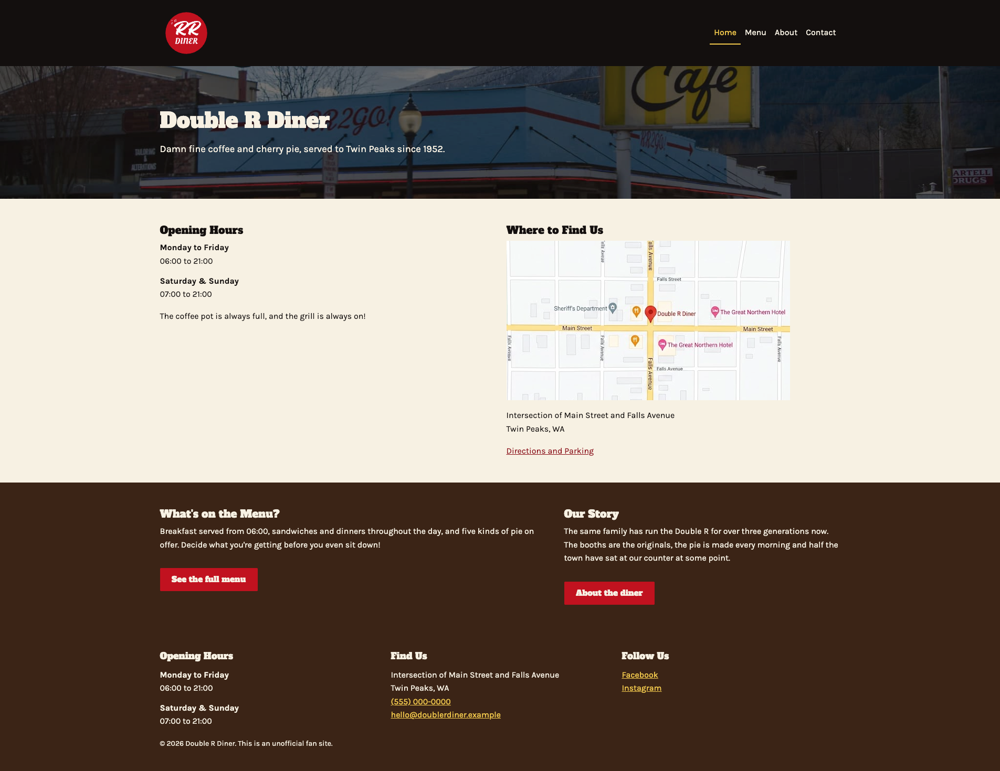

---
## Table of Contents

1. [Project Rationale](#project-rationale)
2. [User Experience (UX)](#user-experience-ux)
	1. [Strategy](#strategy)
	2. [Scope](#scope)
	3. [Structure](#structure)
	4. [Skeleton](#skeleton)
	5. [Surface](#surface)
3. [Features](#features)
4. [Technologies Used](#technology-used)
5. [Testing](#testing)
6. [Deployment](#deployment)
7. [Credits](#credits)
8. [Acknowledgements](#acknowledgements)
9. [Disclaimer](#disclaimer)

---
## Project Rationale

This site exists to provide residents, visitors or people travelling through the town of Twin Peaks, Washington, a clear understanding of what the Double R Diner has to offer. One of the biggest issues that face consumers (specifically within the hospitality industry) is that local family-owned establishments typically tend not to have their menu online; so you're not able to research or plan your meal ahead. This is particularly an issue for tourists or travellers - locals will usually have perfect knowledge of their area and the food establishments within it, but non-locals won't. The owner currently has a huge problem; locally the Diner is known for its pie and coffee, as well as being adopted as a gathering place for the townsfolk. Right now, these core differentiators are not communicated to the target audience outside of local knowledge. 

This solves multiple problems: 
1. For the non-locals or non-regular customers of the Double R Diner, it provides them with the menu ahead of time for their consideration. This allows them to self-select if this establishment is for them, rather than arriving and taking up a table only to leave moments later once they have had a chance to read the menu. 
2. For the business, it allows them to showcase their offering to the public. It allows them to put their best foot forward with both existing and potential consumers without ever having to talk to them, as well as offering the chance to explain the history of the establishment and what makes them different. Vital marketing opportunities that are often missed, and help businesses to stand out in crowded marketplaces against chain brands.
3. Opens the door to future investment in user experience. Once a website exists, it's easier to build on it with take-away "order ahead" functionality, as well as "book a table" functions or "Order by QR code"/ "Pay by QR code", again, helping them to stand out in a crowded marketplace and put themselves on a more equitable footing against well-funded chain competitors. 

---
## User Experience

### Strategy

#### Site Owner's Goals: 
- Showcase their offering to the market
- Effectively communicate what makes them different
- Compete against chain brands

#### External User's Goals: 
- See the menu and prices ahead of time
- Decide whether this establishment is the right fit for their needs/budget
- Find out where it is, and when it's open

#### User Stories

**First-time visitor**
1. As a first time visitor, I want to know what the establishment serves and how much it costs so that I can decide if this is the kind of place I want to spend my money. 
2. As a first time visitor, I want to find out whether this establishment is open so that I don't make a wasted journey. 
3. As a first time visitor, I want to find out where this business is located so that I can plan my route ahead of time. 

**Returning visitor**
4. As a returning visitor, I want to check if the opening hours have changed so that I am not disappointed if I arrive and they are closed. 
5. As a returning visitor, I want the ability to see if the diner has regular specials so that I can try them before leaving. 
6. As a returning visitor, I want to see if there is anything specific on the menu so that I can decide if I would rather eat elsewhere if it's not. 

**Frequent visitor**
7. As a frequent visitor, I want to learn about the people behind the diner so that I can satisfy my curiosity about a local business. 
8. As a frequent visitor, I want to make sure that the Diner can accommodate a group so that I can plan a meeting with friends or family. 

### Scope

#### Features Included

| Feature                                            | User Story | Rationale                                                                                                                                                                         |
| -------------------------------------------------- | ---------- | --------------------------------------------------------------------------------------------------------------------------------------------------------------------------------- |
| Main navigation                                    | all        | This serves to ensure that the user is able to quickly and easily access the page with the information they need.                                                                 |
| Hero section with diner name, tagline and location | 1, 3       | This serves to confirm the name, location and branding of the Diner itself.                                                                                                       |
| Menu page, sectioned with prices                   | 1, 6       | This serves to display the menu items on offer, allowing potential customers to either decide their order ahead of time or self-select out.                                       |
| Specials section on the menu page                  | 5          | This allows the Diner to showcase their regular daily specials.                                                                                                                   |
| Opening hours block                                | 2, 4       | This ensures that prospective customers can plan accordingly and reduces disappointment through vague opening hours.                                                              |
| Address and map image                              | 3          | This states clearly where the Diner is located, ensuring that prospective customers are able to easily find the location.                                                         |
| Directions and parking note                        | 3          | This makes it easier for non-locals to find the Diner, and alleviates any concerns about parking options.                                                                         |
| About page - history and the people                | 7          | This brings the business to life and differentiates them from an otherwise bland and faceless market crowded with chain brands.                                                   |
| Group and seating information                      | 8          | This gives locals (but others too) permission to bring larger groups and increase average spend per visit.                                                                        |
| Phone number                                       | 8          | This gives prospective customers the opportunity to easily get in touch to either book for a large group, or ask any questions that are not answered by the site.                 |
| Footer with hours, address, social links           | 2, 3, 4    | This reiterates the opening hours and locations, along with ensuring that the information is reachable from every page. It also offers alternative ways to engage with the brand. |
| 404 page                                           | -          | This exists to direct users who hit a non-existent page back to existing pages helpfully, rather than allowing them to bounce off the site.                                       |
#### Features Left to Implement

| Feature                      | Why deferred                                                                                                                                                                                                                                            |
| ---------------------------- | ------------------------------------------------------------------------------------------------------------------------------------------------------------------------------------------------------------------------------------------------------- |
| Order ahead for takeaway     | Requires server-side order handling, a database and payment processing. Out of scope for a static HTML and CSS project.                                                                                                                                 |
| Table booking                | Requires form processing, storage of bookings and availability logic, none of which a static site is able to support.                                                                                                                                   |
| QR code ordering and payment | Dependent on the ordering system mentioned above as well as an integrated payment provider, making this perhaps the furthest from the current scope.                                                                                                    |
| Rotating dated specials      | Would require the diner to update content without editing the code, and so would require an admin interface as well as a database. The current site instead presents permanent recurring specials, which stay accurate for longer without maintenance.  |

### Structure
The site is built as four content pages plus a 404 page. Content is assigned to pages according to when a visitor is likely to need it, rather than simply by category alone. The primary audience is someone deciding whether to stop at the diner, often while travelling, so the information that decision depends on surfaces early rather than being placed behind navigation. 

#### Site Map

**Home** acts as the landing page and answers the three questions a prospective customer is likely to ask first: Is it open? Where is it? What food is the place known for? The practical details such as opening hours and location should appear above the fold alongside the Diner's name and positioning, with easy routes onward to the menu and about pages below. 

- Hero: Diner name, tagline or review, locations *(Stories 1, 3)*
- Opening hours *(Stories 2, 4)*
- Address summary and map *(Story 3)*
- Signposting to Menu and About (Menu is the primary decision making content for a first time visitor, and so I've opted for an unequal split to give it more visual weight.)

**Menu** showcases the full offering clearly and without assuming any local knowledge. Every item is priced and described so that a first time visitor can assess the diner on the same terms as a regular. 
- Sectioned menu with prices and descriptions *(Stories 1, 6)*
- Regular specials section *(Story 5)* (This section presents a fixed rotation of specials for each day of the week. This is an explicit design choice as a static site cannot determine the current day.)

**About** differentiates the Diner from chain competitors by giving it a history and a face. This page will cover who runs it, how long it has been there, and the vital role it plays as a gathering place for the town. 
- History and the people behind the Diner *(Story 7)*
- The Diner's role within the town *(Story 8)*

**Contact** leads with the practical information a visitor is likely to require to actually arrive or get in touch. The contact form sits below this, as a secondary route rather than a primary one. The reasoning behind this is that a phone call is the fastest path for most common enquiries such as arranging a group visit, so this is given precedence. 
- Address, map, directions and parking *(Story 3)*
- Phone number and email *(Story 8)*
- Opening hours *(Stories 2, 4)*
- Contact form with HTML5 validation 

**404** page will catch visitors who accidentally reach a non-existent page and returns them to the site without requiring the use of the browsers back button. 

```
HOME
|_ MENU
|_ ABOUT
|_ CONACT
404
```

##### Repeated Content
Opening hours and the Diner's address appear in the footer of every page as well as their dedicated sections. This is deliberate, as stories 2, 3 and 4 require this information to be available without having to hunt for it, and a visitor who lands directly on the Menu page from a search result should not have to navigate elsewhere to find out whether the Diner is open. 

##### Navigation
A single main navigation menu appears in the same position on every page, listing all four content pages. It will collapse into a toggle menu on smaller screen widths. The current page is indicated so that visitors always know where they are within the site. 

All external links (social media) will open in a new tab so that visitors are not navigated away from the site unintentionally. 

##### Information Priority
Within each page, content is ordered by inferred decision-relevance instead of narrative interest. On the Home page, this means that practical facts are before the atmosphere; on the Menu page, food precedes the framing of the establishment; on Contact, this means reaching the Diner precedes the form. Headings are used to convey this hierarchy structurally as well as visually, so the ordering is consistent and accessible for users of screen readers as well as those who are scanning the page. 

### Skeleton

#### Wireframes

Wireframes were created for all pages at three breakpoints before any code was written. 

For ease, above the fold is shown with a #FEFCE0 background, and below the fold is shown with a #EBEBEB background. 

| Page | Mobile | Tablet | Desktop|
|---|---|---|---|
| Home | [link](assets/images/readme/wireframes/home-mobile.png) | [link](assets/images/readme/wireframes/home-tablet.png) | [link](assets/images/readme/wireframes/homepage-desktop.png) |
| Menu | [link](assets/images/readme/wireframes/menu-mobile.png) | [link](assets/images/readme/wireframes/menu-tablet.png) | [link](assets/images/readme/wireframes/menu-desktop.png) |
| About | [link](assets/images/readme/wireframes/about-mobile.png) | [link](assets/images/readme/wireframes/about-tablet.png) | [link](assets/images/readme/wireframes/about-desktop.png) |
| Contact | [link](assets/images/readme/wireframes/contact-mobile.png) | [link](assets/images/readme/wireframes/contact-tablet.png) | [link](assets/images/readme/wireframes/contact-desktop.png) |

### Surface

#### Colour Scheme
For the colour palette, inspiration was drawn from the diner itself. The red and black of the signage, the dark wood panelling and red vinyl booths from the interior and the warm amber from the lamps and neon against the Washington night sky. Cream stands in for the paper menu, and provides a background warm enough to comfortably sit against the wood tones (pure white would feel too clinical and defeat the period feel of the brand).

| Colour | Hex | Used for |
|---|---|---|
| Diner Red | #C1121F | Section backgrounds, buttons and banners. Surface colour only. |
| Deep Red | #8B0F17 | Red text, headings, links. Text colour only. |
| Ink | #14100E | Body text on light backgrounds, dark section backgrounds. |
| Wood | #3B2417 | Secondary dark background colour, footer. |
| Cream | #F7F1E3 | Default page background, text on dark backgrounds. |
| Sign Yellow | #F2C94C | Highlights and accents for dark backgrounds only. |
| Amber | #E9A319 | Warm accent for dark backgrounds only. |

I have deliberately chosen two distinct reds (Diner Red and Deep Red). The brighter of the two is used as a background for other elements to sit on, whereas the darker red is used as text. This keeps the brand colour present across the site without any text falling short of WCAG AA.

#### Contrast Ratios
All combinations used have been tested with the WebAIM Contrast Checker. Body text meets AA (4.5:1) as a minimum but most combinations meet AAA (7:1)

| Foreground | Background | Ratio | WCAG |
|---|---|---|---|
| Ink #14100E | Cream #F7F1E3 | 16.80:1 | [AAA](https://webaim.org/resources/contrastchecker/?fcolor=14100E&bcolor=F7F1E3) |
| Wood #3B2417 | Cream #F7F1E3 | 12.85:1 | [AAA](https://webaim.org/resources/contrastchecker/?fcolor=3B2417&bcolor=F7F1E3) |
| Cream #F7F1E3 | Wood #3B2417 | 12.85:1 | [AAA](https://webaim.org/resources/contrastchecker/?fcolor=F7F1E3&bcolor=3B2417) |
| Sign Yellow #F2C94C | Ink #14100E | 11.92:1 | [AAA](https://webaim.org/resources/contrastchecker/?fcolor=F2C94C&bcolor=14100E) |
| Sign Yellow #F2C94C | Wood #3B2417 | 9.12:1 | [AAA](https://webaim.org/resources/contrastchecker/?fcolor=F2C94C&bcolor=3B2417) |
| Deep Red #8B0F17 | Cream #F7F1E3 | 8.56:1 | [AAA](https://webaim.org/resources/contrastchecker/?fcolor=8B0F17&bcolor=F7F1E3) |
| Amber #E9A319 | Ink #14100E | 8.75:1 | [AAA](https://webaim.org/resources/contrastchecker/?fcolor=E9A319&bcolor=14100E) |
| White #FFFFFF | Diner Red #C1121F | 6.22:1 | [AA](https://webaim.org/resources/contrastchecker/?fcolor=FFFFFF&bcolor=C1121F) |
| Cream #F7F1E3 | Diner Red #C1121F | 5.53:1 | [AA](https://webaim.org/resources/contrastchecker/?fcolor=F7F1E3&bcolor=C1121F) |

Two colour combinations were tested but rejected. Diner red on Ink returns 3.03:1 [which fails AA](https://webaim.org/resources/contrastchecker/?fcolor=C1121F&bcolor=14100E) for body text despite being the most visually charateristic pairing available with the palette (the look of red neon against a night sky). Therefore it will only be used at large display sizes where the threshold of 3:1 applies, with Sign Yellow used in its place for anything smaller. 

Amber on Cream [returns 1.91:1](https://webaim.org/resources/contrastchecker/?fcolor=E9A319&bcolor=F7F1E3) and is therefore not used at all. Amber functions only as a glow against dark surfaces.

#### Typography
Two typefaces are used for this site, both available from Google Fonts. 

- [**Alfa Slab One**](https://fonts.google.com/specimen/Alfa+Slab+One?preview.script=Latn) is used for headings and the site wordmark. It is a heavy slab serif that invokes the hand-painted signage and menu boards of mid-century modern American roadside diners. Used sparingly, and at large sizes, where its weight shows character rather than mess. 
- [**Karla**](https://fonts.google.com/specimen/Karla?query=Karla&preview.script=Latn) is used for body copy, navigation and menu items. It is a humanist sans-serif chosen for its legibility at small sizes, especially on the Menu page where item descriptions and prices need to be scanned quickly. It is neutral enough not to compete with the display font face. 

Fallback font stacks are specified throughout so that the site remains readable in the circumstance that the web fonts fail to load. 

```css
--font-display: 'Alfa Slab One', Georgia, 'Times New Roman', serif;
--font-body: 'Karla', 'Helvetica Neue', Arial, sans-serif;
```

#### Imagery
Photography needed to carry the warmtht that the chosen palette established: interior photograhs of the booths and counter, close detailing of the pie and coffee that the Diner is known for, and the exterior at dusk. Images are there to support the content, not decorate it. The Menu page uses food photography where possible to make the offering feel real, and the About page uses interior and exterior photographs to show the Diner's place in the town. 

All images are used at a sufficient resolution to avoid pixelation and are constrained by aspect ratio rather than stretched to fit their containers. 

Where text appears over a photograph, a semi-transparent dark overlay is applied to make sure that the text meets the same contrast requirements as elsewhere on the site. No text is placed directly over an unmodified photograph. 

#### Accessibility Considerations

- All non-text elements carry descriptive `alt` attributes: decorative images use an empty `alt` so that screen readers skip them for ease of use. 
- All text meets WCAG AA contrast as a minimum, with the combinations and ratios recorded above. 
- Semantic HTML5 elements convey document structure, so headings and landmarks are meaningful to anyone using assistive technology rather than just visually.
- Information is never presented using colour alone. Anything distinguished by colour is also distinguished by text, position, or an icon. 
- Interactive elements retain their visible focus state so that the site is navigatable by keyboard. 
- Font sizes are set in relative units so they respond to browser text-size settings. 

#### Design Decisions That Depart from Convention
No deliberate departures from accepted UX or design convetion were made. The single case where an instinctive design choice was rejected on accessibility grounds was red text on a near-black background to imitate neon signage is doucmented under [contrast ratios](#contrast-ratios) above, along with the pairing used instead. 

## Features

### Existing Features
#### Main Navigation
A single navigation menu appears in the same position on every page, listing all four content pages. On screen sizes below 992px it collapses into a toggle menu. The current page is marked with both a colour change and an underline, so the indicator isn't relying solely on colour. 
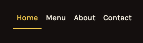

#### Hero Section
The home page loads with a photo of the diner, the name, and a one-liner tagline. A semi-transparent dark overlay is applied on the photograph but behind the text so that the heading meets the same contrast requirements as text elsewhere on the site. 
*This covers user stories 1 and 3.*
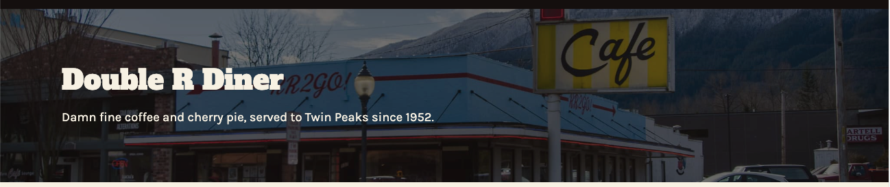

#### Opening Hours and Location
Opening hours and the address appear together above the fold on the home page before any other content. A visitor deciding whether they want to stop here needs both before any other information, so they are given priority over the atmosphere of the diner. 
*This covers user stories 2, 3 and 4*
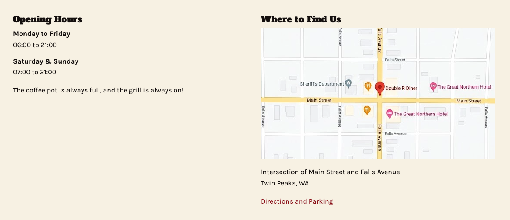

#### Weekly Specials
The menu page opens with three specials cards: soup of the day, catch o' the day and pie of the day. Because a static site is unable to work out the current day, these present a fixed weekly rota instead of a single current item. Hard-coding "today" would be wrong far more oftne than it's right, so a rota is more accurate and lets a returning visitor plan for the future. 
*This covers user story 5*


#### Full Menu
The menu is broken into six sections covering breakfast, sandwiches, sides, beverages, dinners and desserts. Every item is priced and items that do not have descriptive names are given a description. Item name and price share a line with the description beneath, so the layout sticks on smaller screens without wrapping the price. 

Sections are split across two columns at desktop by length rather than by meal order, so both columns end at a similar depth. 
*This covers user stories 1 and 6*


#### The People Behind the Counter
The about page introduces the diner's history and the people who run it. This gives an independent business a face that chain competitors cannot match. 
*This covers user story 7*
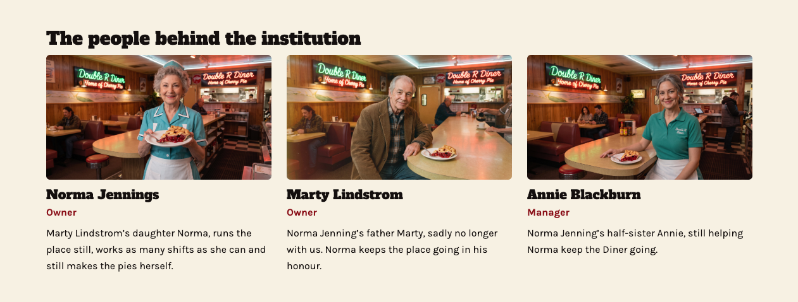

#### Group and Seating Information
Seating capacity is described on the about page and gives users a practical instruction to call ahead, appearing on both the about and contact pages, with the telephone number as a `:tel` link. 
*This covers user story 8*
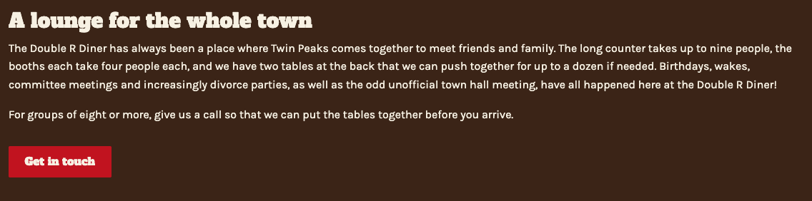
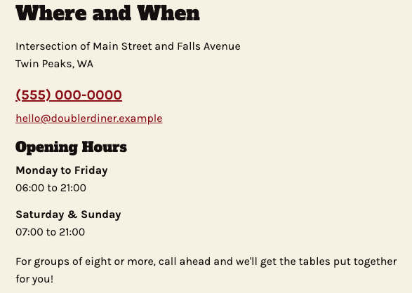

#### Contact Form
A three-field form was created to capture name, email address and a short message. It sits below the practical contact information in `contact.html`. Every field has a visible label rather than a placeholder, and validation is handled through HTML5 attributes: 
All three fields are `required`, and the email field uses `type="email"` so that the browser checks formatting before allowing the form to be submitted. 

The form itself posts to the Code Institute form dump endpoint, which shows the submitted data back to the user. This confirms to the visitor that their message has been sent, rather than leaving them on a page with no indication of if anything has happened. 

The form is positioned below the address, telephone number and opening hours rather than above them. The most common enquiry the diner is likely to receive is arranging group table bookings, and a telephone call will solve that faster than a message, so the telephone number took precedence in the page order. 
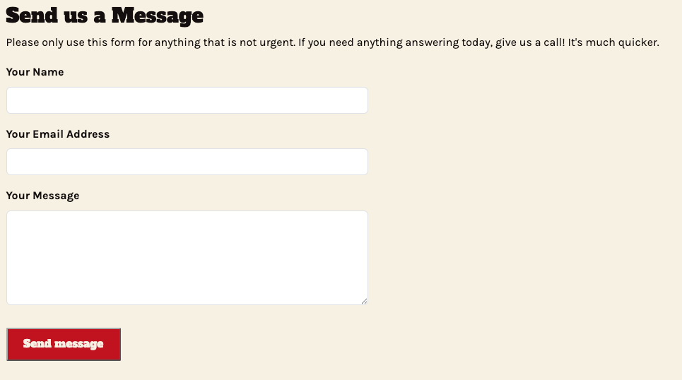

#### 404 Page
A custom 404 page catches visitors who reach a dead URL that does not exist, offering them four routes back into the site as well as a button to the home page, so they never need to rely on their browsers back button. 

Because GitHub Pages serves `404.html` from whatever URL was mistyped, every local path on that page is absolute rather than relative.
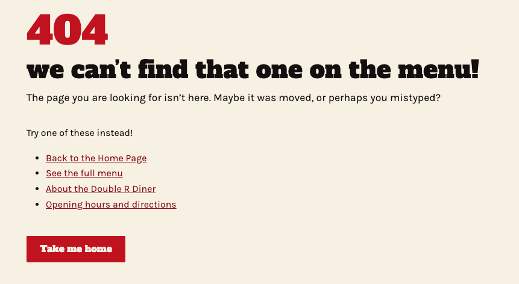

#### Repeated Footer Information
Opening hours and the address appear in the footer of every page as well as their dedicated sections. This was a deliberate choice, so that a visitor who arrives directly on the menu page from search results or direct links can still get the information they need without searching.
*This covers user stories 2, 3 and 4*
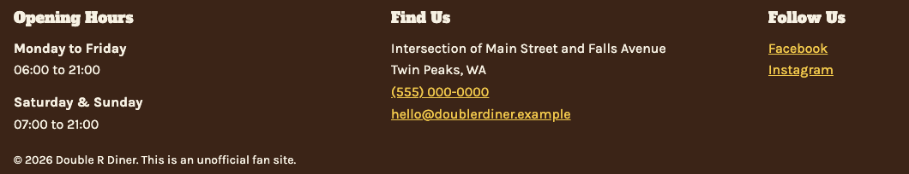

### Features Left to Implement

|Feature | Why deferred |
|---|---|
|Contact form delivered to the diner | The form dump endpoint confirms submission to the visitor, but does not deliver the message to a recipient. Routing would require server-side processing, which is outside the scope of this static HTML and CSS project. |
|Order ahead for takeaway | Requires server-side order handling, a database, and payment processing. |
|Table booking | Requires form processing, booking storage and availability logic, which cannot be supported by a static HTML and CSS project. |
|QR Code ordering and payment | Depends on the above ordering system and an integrated payment provider, placing it furthest from the current scope. |
|Rotating dated specials | Would require the diner to update content without editing any code, which would need a database and admin interface. The current site instead presents a weekly schedule which stays accurate without maintenance. |

## Technology Used

### Languages
- [HTML5](https://developer.mozilla.org/en-US/docs/Web/HTML)
- [CSS3](https://developer.mozilla.org/en-US/docs/Web/CSS)

### Frameworks, Libraries and Programs

| Tool | Used for |
|---|---|
| [Bootstrap 5.3.8](https://getbootstrap.com/) | Responsive grid, navigation component and form controls |
| [Google Fonts](https://fonts.google.com/) | Alfa Slab One and Karla typefaces |
| [Moqups](https://moqups.com/) | Wireframing all pages at three breakpoints |
| [Canva](https://www.canva.com/) | Creating the site logo and editing images |
| [Google Gemini (Nano Banana Pro)](https://gemini.google.com/) | Generating the staff portraits on the about page |
| [Git](https://git-scm.com/) | Version control |
| [GitHub](https://github.com/) | Remote repository |
| [GitHub Pages](https://pages.github.com/) | Hosting the deployed site |
| [Visual Studio Code](https://code.visualstudio.com/) | Development environment |
| [W3C Nu HTML Checker](https://validator.w3.org/nu/) | Validating HTML |
| [W3C Jigsaw CSS Validator](https://jigsaw.w3.org/css-validator/) | Validating CSS |
| [Google Lighthouse](https://developer.chrome.com/docs/lighthouse/) | Auditing performance, accessibility, best practices and SEO |
| [WebAIM Contrast Checker](https://webaim.org/resources/contrastchecker/) | Verifying colour contrast ratios against WCAG AA |
| [Code Institute form dump](https://formdump.codeinstitute.net) | Receiving and echoing contact form submissions |
| [TinyPNG](https://tinypng.com/) | Compressing images to improve load performance |

---

## Testing
### Validator Results
All five pages pass the W3C Nu HTML Checker with no errors or warnings. 

| Page | HTML (W3C) |
|---|---|
| index.html | [Pass](assets/images/readme/testing/index-page-validated.png) |
| menu.html | [Pass](assets/images/readme/testing/menu-page-validated.png) |
| about.html | [Pass](assets/images/readme/testing/about-page-validated.png) |
| contact.html | [Pass](assets/images/readme/testing/contact-page-validated.png) |
| 404.html | [Pass](assets/images/readme/testing/404-page-validated.png) |

The custom stylesheet passes the W3C Jigsaw CSS validator with no errors. 

[CSS Passed validation](assets/images/readme/testing/css-validated.png)

Only the custom stylesheet was validated. Bootstrap's own CSS is a third-party dependency served from a CDN and was not written code for this project.

### Lighthouse Scoring
| Page | Performance | Accessibility | Best Practices | SEO | Link to report |
|---|---|---|---|---|---|
| index.html | 91 | 100 | 100 | 100 | [report](assets/lighthouse-reports/index-page-lighthouse.html) |
| menu.html | 97 | 100 | 100 | 100 | [report](assets/lighthouse-reports/menu-page-lighthouse.html) |
| about.html | 96 | 100 | 100 | 100 | [report](assets/lighthouse-reports/about-page-lighthouse.html) |
| contact.html | 96 | 100 | 100 | 100 | [report](assets/lighthouse-reports/contact-page-lighthouse.html) |
| 404.html | 98 | 100 | 100 | 100 | [report](assets/lighthouse-reports/404-page-lighthouse.html) |

Accessibility, best practices and SEO score at 100 on every page. This independently confirms the contrast ratios recorded in the surface section above, which were checked before any code was started. 

Performance is held below 100 by render-blocking requests and the short cache lifetimes on the Bootstrap and Google Fonts files. These are both external dependencies served from third-party domains and cannot be modified from within this project. The home page scores lowest of the five because it carries the hero photograph, which is the largest single asset on the site. It was compressed from 728KB to 175KB to reduce this. Alongside this, the logo was swapped for an `.svg` version, and the map was also compressed. 

### User Story Testing
**1. As a first time visitor, I want to know what the establishment serves and
how much it costs so that I can decide if this is the kind of place I want to
spend my money.**
 
| Step | Expected | Actual | Result |
|---|---|---|---|
| Opened the home page and read the menu teaser | A summary of what is served, with a route through to the full menu | As expected | Pass |
| Followed the link to the menu page | Every item is listed with a price | As expected | Pass |
[Link to screenshot](assets/images/readme/testing/user-story-1-test.png)

**2. As a first time visitor, I want to find out whether this establishment is
open so that I don't make a wasted journey.**
 
| Step | Expected | Actual | Result |
|---|---|---|---|
| Opened the home page without scrolling | Opening hours are visible above the fold | As expected | Pass |
| Opened the menu, about and contact pages | Opening hours are reachable in the footer of every page | As expected | Pass |
[Link to screenshot](assets/images/readme/testing/user-story-2.png)

**3. As a first time visitor, I want to find out where this business is located
so that I can plan my route ahead of time.**
 
| Step | Expected | Actual | Result |
|---|---|---|---|
| Opened the home page | Address and a map are visible above the fold | As expected | Pass |
| Followed the directions and parking link | Written directions from the highway and parking information are given | As expected | Pass |
[Link to screenshot](assets/images/readme/testing/user-story-test-3.png)

**4. As a returning visitor, I want to check if the opening hours have changed
so that I am not disappointed if I arrive and they are closed.**
 
| Step | Expected | Actual | Result |
|---|---|---|---|
| Opened any page and checked the footer | The full week's opening hours are shown in a consistent position on every page | As expected | Pass |
[Link to screenshot](assets/images/readme/testing/user-story-2.png)

**5. As a returning visitor, I want to see if the diner has regular specials so
that I can try them before leaving.**
 
| Step | Expected | Actual | Result |
|---|---|---|---|
| Opened the menu page | A specials block appears above the full menu | As expected | Pass |
| Read the specials cards | A weekly rota is given for soup and pie, and the catch of the day is explained | As expected | Pass |
[Link to screenshot](assets/images/readme/testing/user-story-menu-test.png)

**6. As a returning visitor, I want to see if there is anything specific on the
menu so that I can decide if I would rather eat elsewhere if it's not.**
 
| Step | Expected | Actual | Result |
|---|---|---|---|
| Opened the menu page and scanned the section headings | Six clearly headed sections group the menu by type | As expected | Pass |
| Read items with non-obvious names | A short description explains what the item contains | As expected | Pass |
[Link to screenshot](assets/images/readme/testing/user-story-menu-test.png)

**7. As a frequent visitor, I want to learn about the people behind the diner so
that I can satisfy my curiosity about a local business.**
 
| Step | Expected | Actual | Result |
|---|---|---|---|
| Opened the about page | The diner's history and the family behind it are described | As expected | Pass |
| Scrolled to the staff section | The people who work there are introduced by name and role | As expected | Pass |
[Link to the screenshot](assets/images/readme/testing/user-story-test-7.png)

**8. As a frequent visitor, I want to make sure that the Diner can accommodate a
group so that I can plan a meeting with friends or family.**
 
| Step | Expected | Actual | Result |
|---|---|---|---|
| Opened the about page and read the group section | Seating capacity is described and a route to arrange a visit is given | As expected | Pass |
| Followed the link to the contact page | The telephone number is prominent and the group instruction is repeated | As expected | Pass |
| Selected the telephone number on a mobile device | The device offers to dial the number | As expected | Pass |
[Link to screenshot](assets/images/readme/testing/user-story-test-7.png)

### Manual Feature Testing
 
| Feature | Test | Expected | Actual | Result |
|---|---|---|---|---|
| Main navigation | Clicked every navigation link from every page | The correct page loads each time | As expected | Pass |
| Current page indicator | Visited each page in turn | The current page is marked in the navigation | As expected | Pass |
| Navigation toggle | Reduced the viewport below 992px and opened the menu | The toggle appears and the menu expands and collapses | As expected | Pass |
| Logo link | Clicked the logo from every page | Returns to the home page | As expected | Pass |
| External links | Clicked both social links | Each opens in a new tab, leaving the site open | As expected | Pass |
| Telephone link | Selected the number on a mobile device | The device offers to dial | As expected | Pass |
| Email link | Selected the email address | The default mail client opens with the address filled in | As expected | Pass |
| Internal content links | Clicked the menu, about and contact links within page content | Each loads the correct page | As expected | Pass |
| Contact form — valid submission | Completed all three fields and submitted | The form submits and a confirmation page shows the submitted values | As expected | Pass |
| Contact form — empty required field | Left the name field blank and submitted | The browser blocks submission and prompts for the missing field | As expected  Pass |
| Contact form — invalid email | Entered an address with no @ symbol and submitted | The browser blocks submission and prompts for a valid address | As expected | Pass |
| Keyboard navigation | Tabbed through each page from top to bottom | Every link, button and form field receives a visible focus state in a logical order | As expected | Pass |
| 404 page | Visited a URL that does not exist | The custom 404 page loads, fully styled, with working links back into the site | As expected | Pass |

Screenshots of the form tests: 
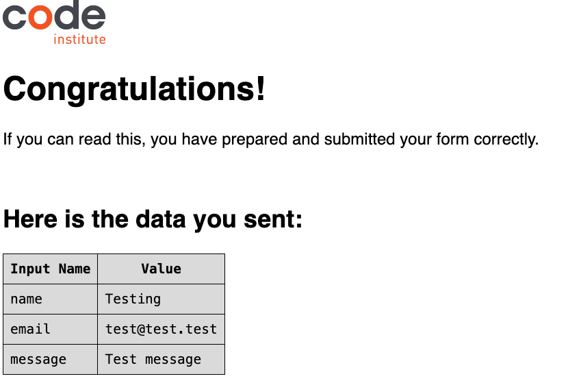
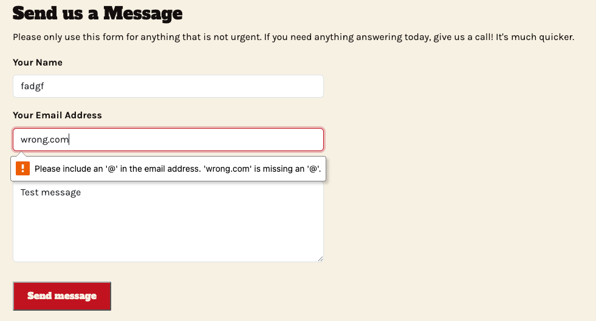

### Responsiveness Testing
Tested using Chrome DevTools device emulation and by resizing the browser window on the deployed site.

| Width | Device | Expected | Result |
|---|---|---|---|
| 375px | Mobile | Single column throughout, toggle navigation, hours and location above the fold | Pass |
| 768px | Tablet | Paired columns on the home page, two-column menu, single-column form | Pass |
| 992px | Navigation breakpoint | Navigation switches between toggle and inline without overlap | Pass |
| 1440px | Desktop | Full layout as wireframed, two-column menu, uneven teaser split on the home page | Pass |

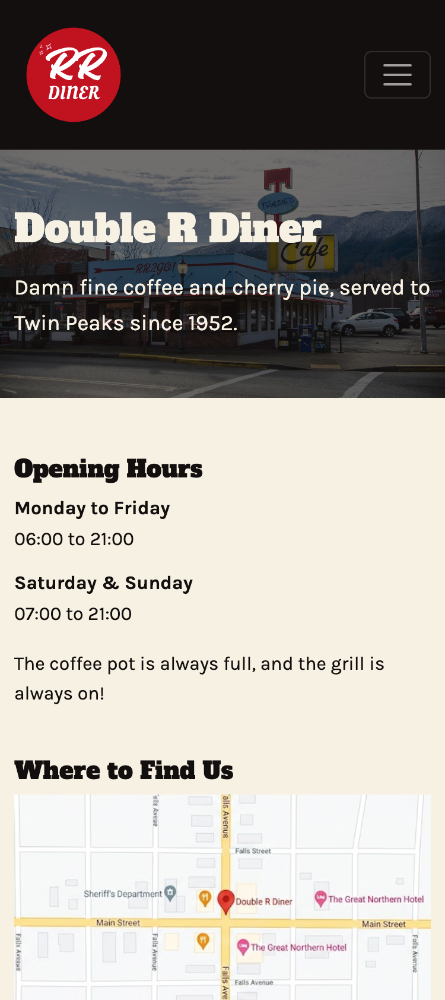
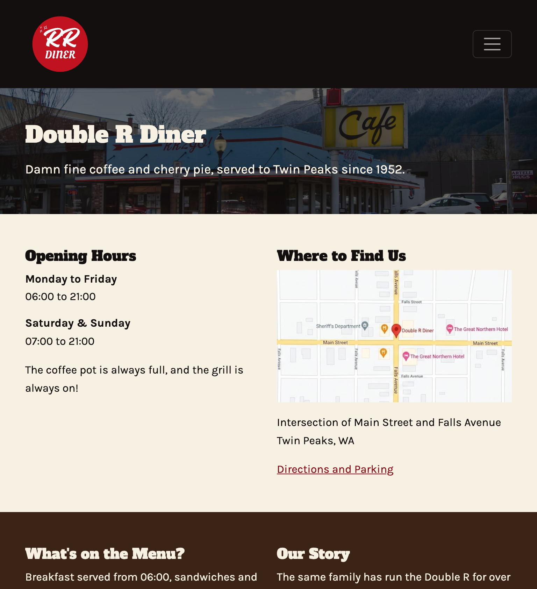
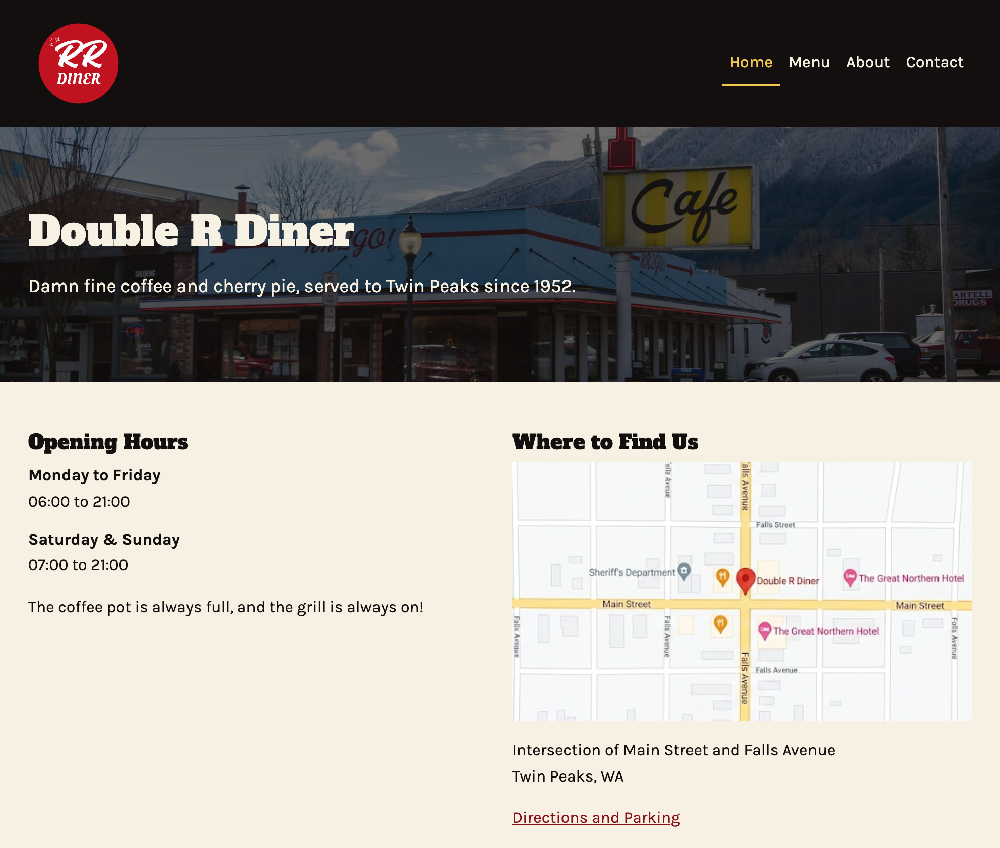
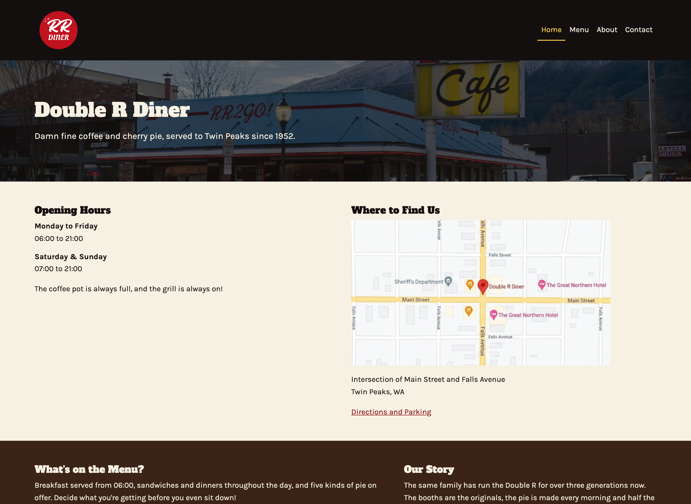


### Browser Compatibility
 
| Browser | Version | Result | Notes |
|---|---|---|---|
| Google Chrome | 152.0.79777.77 (Official Build)(arm64) | Pass | |
| Mozilla Firefox | 155.0.1 (64-bit) | Pass | |
| Safari | 26.6.2 (21624.5.1.11.3) | Pass | |

### Bugs

#### Fixed

**Custom stylesheet had no effect on any page**
- **Issue:** After adding the stylesheet, no custom styles applied anywhere. The background, navigation and link colours all remained at browser and Bootstrap defaults, despite the file being linked in the head.
- **Diagnosis:** The DevTools Network tab showed the stylesheet loading successfully, which ruled out an incorrect path. Inspecting the page structure showed that the `<header>` element sat between `</head>` and `<body>`, and a second `<body>` tag appeared further down the file. 
- **Cause:** While assembling the page from reusable snippets, the header had been pasted outside the body element and a rogue duplicate `<body>` element introduced. Browsers usually handle errors like this themselves so the page still rendered and no error was reported by the editor. 
- **Fix:** Removed the duplicate tag and moved the header inside the body. Rather than relying on re-usable snippets, every other page was coped from the `index.html` that I knew worked, and only content within `<main></main>` was changed.

**Specials rota rendered as stacked pairs, not side by side**
- **Issue:** On the menu page, the day and the item in the specials rota appeared on separate lines instead of sitting side by side as designed. 
- **Diagnosis:** On inspecting the `<dt>` elements in DevTools, it showed that none of the `.rota` rules were being applied to them, although the sibling `<dd>` rules were working. 
- **Cause:** The selector had been written as `.rota-dt` rather than `.rota dt`. A hyphen instead of a space meant that the styling was not applying, as the rule was targeting a class of `.rota-dt`, which did not exist. No error was reported as CSS fails quietly when a selector matches nothing. 
- **Fix:** Corrected the selector to `.rota dt`.

**Menu page failed HTML validation with no visible symptom**
- **Issue:** The menu page rendered correctly in every browser, but returned two errors from the W3C validator: an unclosed `div` element and an unexpected closing `section` tag.
- **Diagnosis:** The validator identified the opening `<div class="row g-3">` in the specials block as the unclosed element. The second error was a consequence of the first, not a separate problem. 
- **Cause:** The closing tag for the Bootstrap row had not been added. Browsers will close these unterminated elements itself, so the page appeared correct. 
- **Fix:** Added the missing closing tag. Both errors then cleared. 

**Navigation toggle was invisible against the dark navigation bar**
- **Issue:** Below 992px, the navigation toggle was practically invisible. It's icon and border are dark by default and the navigation bar background is close to near-black.
- **Cause:** Bootstrap's default toggle styling is designed for a light navigation bar. 
- **Fix:** Applied `data-bs-theme="dark"` to the `<nav>` element so that Bootstrap uses it's light-on-dark variables for that component. 

**Favicon and stylesheet failed to load on the deployed site**
- **Issue:** Several assets loaded correctly in local development, but returned 404 on the deployed site. 
- **Cause:** Local paths had been written with a leading slash. On a GitHub pages project the leading slash resolves to domain root, rather than the repo, so `/assets/images/favicon.ico` pointed at a location that was outside of the project.
- **Fix:** Changed local paths on all four content pages to relative. The 404 page is an exception and requires absolute paths including the repo name, because GitHub pages serves it from whatever URL was mistyped. 

**Invalid CSS value rejected by Jigsaw**
- **Issue:** The Jigsaw validator reported an error in the `.rota` rule. 
- **Cause:** A font size had been typed as `09.rem` rather than `0.9rem`. The declaration was quietly discarded by the browser, so the effect was too subtle to be noticed visually. 
- **Fix:** Corrected the value. At the same time, I corrected `var(-deep-red)` to `var(--deep-red)` in the button hover rule, which had been failing for the same reason: a single hyphen instead of two. 

**Name field was not being submitted from the form**
- **Issue:** The name field was not being submitted with the other fields on the form. 
- **Cause:** The input had no `name` attribute. It had `id="name"` but no `name="name"` attribute, so it was not being submitted.
- **Fix:** Added the `name="name"` attribute, and re-tested.

**Unfixed**

No known bugs remain in the deployed site. Performance scores below 100 are caused by third-party CDN behaviour rather than by errors in the project code, as described under Lighthouse Scoring above. 

---

## Deployment
### Deploying to GitHub Pages

This site was deployed to GitHub Pages using the following steps: 
1. Log in to GitHub and open the
   [Double-r-diner repository](https://github.com/NathanPearson-91/Double-r-diner).
2. Select **Settings** from the repository menu.
3. Select **Pages** from the sidebar on the left.
4. Under **Source**, select **Deploy from a branch**.
5. Under **Branch**, select **main** and **/(root)**, then select **Save**.
6. Wait for the page to refresh. A message appears at the top of the Page settings giving the published URL.

The live site is available at
[https://nathanpearson-91.github.io/Double-r-diner/](https://nathanpearson-91.github.io/Double-r-diner/).
 
Deployment can take a few minutes to complete after the first save, and after each push to the main branch.

### Forking the Repository
 
Forking creates a copy of the repository in your own GitHub account, which you can change without affecting the original.
 
1. Log in to GitHub and open the
   [Double-r-diner repository](https://github.com/NathanPearson-91/Double-r-diner).
2. Select **Fork** at the top right of the repository page.
3. Select an owner for the fork, and if needed, change the repository name.
4. Select **Create fork**.

### Cloning the Repository Locally
 
1. Open the repository page on GitHub.
2. Select the green **Code** button above the file list.
3. Select **HTTPS** and copy the URL shown.
4. Open a terminal on your computer and navigate to the directory where you
   want the project to live.
5. Type `git clone` followed by the URL you copied, then press Enter:

```bash
	git clone https://github.com/NathanPearson-91/Double-r-diner.git
```
6. Change into the new repository:

```bash
	cd Double-r-diner
```
The project is a static site with no build step and no dependencies to install. You can open `index.html` in a browser to view it, or use a local development server such as the Live Server Extension for Visual Studio Code. 

---

## Credits

### Code
 
| Source | Used for | Location in project |
|---|---|---|
| [Bootstrap 5 documentation — Navbar](https://getbootstrap.com/docs/5.3/components/navbar/) | Responsive navigation bar structure and toggle. The dropdown, disabled link and search form were removed, and the links, IDs and alignment changed for this site. | Header of all five pages |
| [Bootstrap 5](https://getbootstrap.com/) | Grid system, form controls and utility classes throughout | All pages |
| [Code Institute form dump](https://formdump.codeinstitute.net) | Form action target, provided for student projects | `contact.html` |
 
All other HTML and CSS in this project was written by me. External code is
marked with a comment above it in the source file.

### Content
 
All written content on the site, including the menu descriptions, the diner's history and the staff biographies, was written by me for this project, taken from "The Secret History of Twin Peaks", a book written by Mark Frost. The diner and the people described are fictional.
 
 ### Media
 
| Asset | Creator | Source and licence |
|---|---|---|
| `hero-diner-exterior.jpg` | Jeff Hitchcock | [Flickr](https://www.flickr.com/photos/arbron/24181390613), [CC BY 2.0](https://creativecommons.org/licenses/by/2.0/). Resized and compressed for use on this site. |
| `logo.png` | Created by me | Made in Canva |
| `favicon.ico` | Created by me | Generated from the site logo |
| `map.png` | Generated by me | Created using Google Gemini (Nano Banana Pro) |
| Staff portraits on the about page | Generated by me | Created using Google Gemini (Nano Banana Pro) |

### Fonts
 
- [Alfa Slab One](https://fonts.google.com/specimen/Alfa+Slab+One) and
  [Karla](https://fonts.google.com/specimen/Karla), both served from
  [Google Fonts](https://fonts.google.com/).

  ---

## Acknowledgements

- **Andy Lochtie**: My business partner and best friend, for testing the site and offering suggestions when I was stuck with wireframes. 
- **Sophie Pearson**: My wife, for putting up with me constantly bugging her and asking if "that looked OK" as she walked past my desk while working on this. 
- **Hana_201671**: From the Code Institute Community Discord, for answering my question about images made with generative AI quickly. 
- **Miguel Legorreta**: My course tutor, for taking the time to help me get to grips with the project requirements. 
- **Evelyn Pearson**: My daughter, for sitting on my knee and giving me the best motivation to keep going with this. 

---
## Disclaimer
 
This is an unofficial, non-commercial fan project created for educational purposes. The Double R Diner is a fictional location from the television series *Twin Peaks*. This site is not affiliated with, endorsed by, or connected to the rights holders of that series in any way.